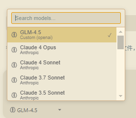

# open-superdesign
support custom baseurl apikey model set, vscode extension

by my test i recommend use Qwen3-Coder-480B-A35B-Instruct(from modelscope) as model;

```json
{
    "workbench.colorTheme": "Solarized Light",
    "git.confirmSync": false,
    "github.copilot.advanced": {},
    "superdesign.customModels": [
        {
            "name": "GLM-4.5",
            "baseUrl": "https://open.bigmodel.cn/api/paas/v4/",
            "model": "glm-4.5-x",
            "apiKey": "xxxxxxxxxxxxxxxxxxxxxxxxxxxxxxxxxxxxx",
            "provider": "openai"
        },
        {
            "name": "Qwen/Qwen3-Coder-480B-A35B-Instruct",
            "baseUrl": "https://api-inference.modelscope.cn/v1/",
            "model": "Qwen/Qwen3-Coder-480B-A35B-Instruct",
            "apiKey": "xxxxxxxxxxxxxxxxxxxxxxxxxxxxxxxxxxxxx",
            "provider": "openai"
        },
    ],
    "superdesign.aiModelProvider": "custom",
    "superdesign.aiModel": "GLM-4.5"
}
```

after set restart extension by ctrl+shift+p -> restart extension



